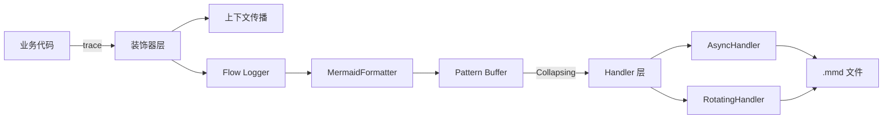
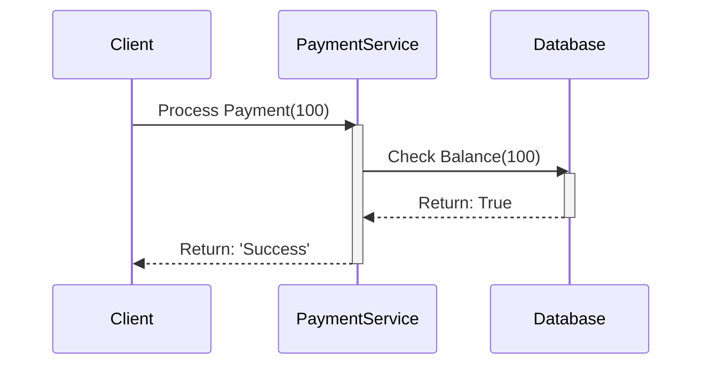
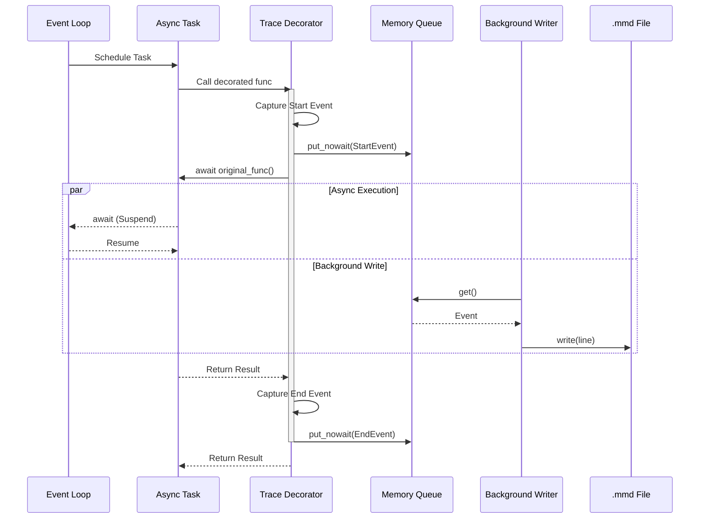
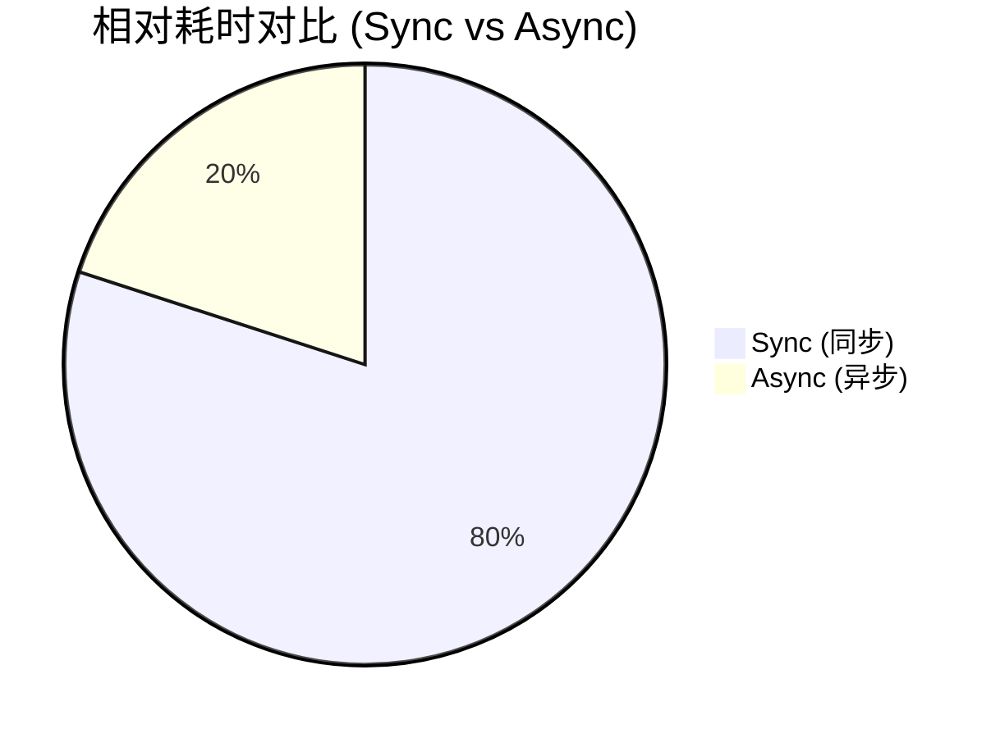
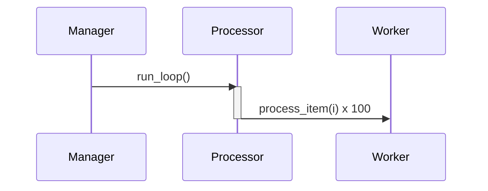
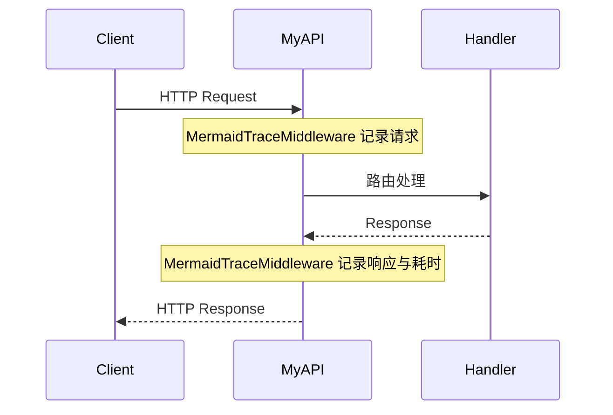
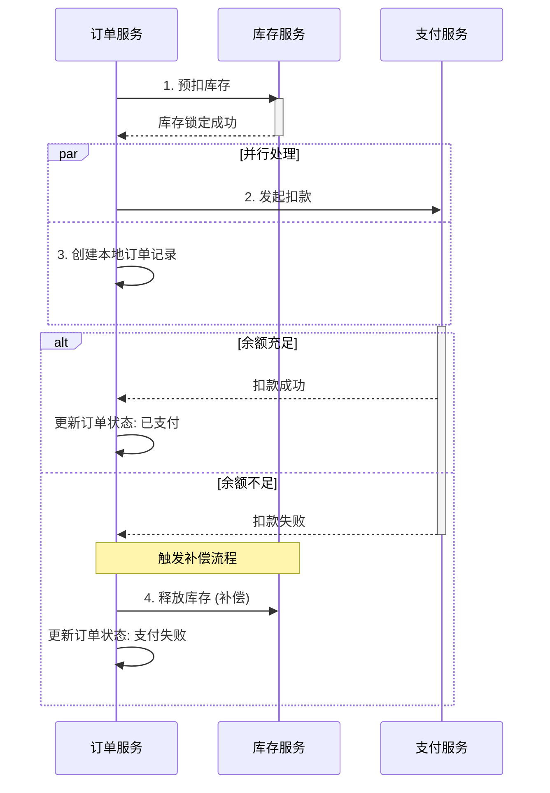
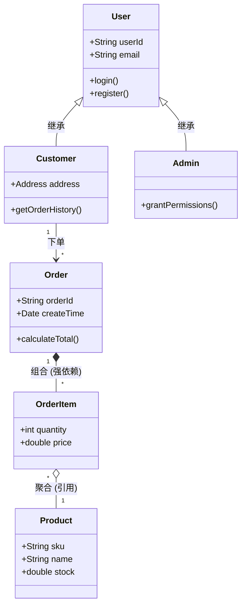
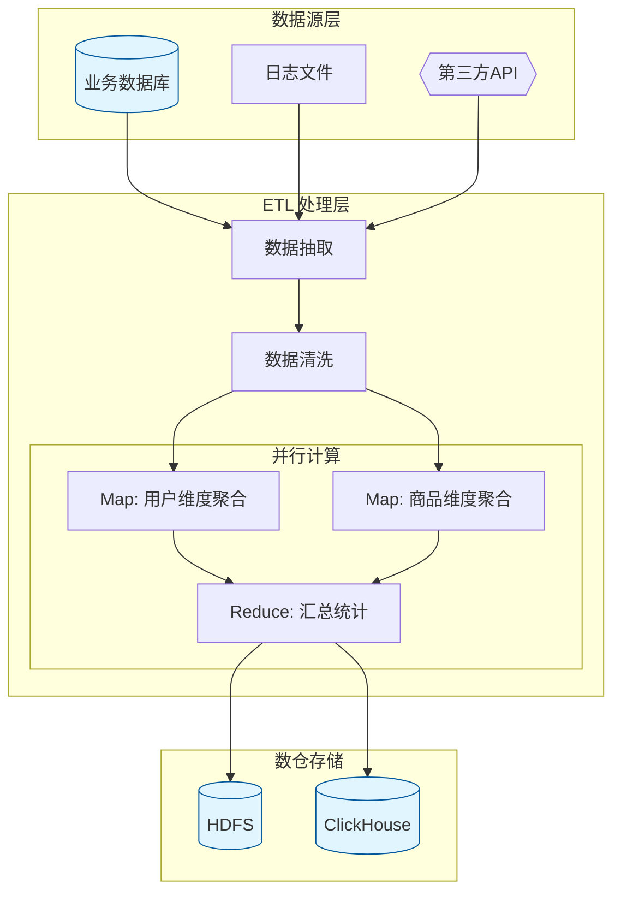

<div align="center">
  
  <h1><strong>玄同 765</strong></h1>
  <p><strong>大语言模型 (LLM) 开发工程师 | 中国传媒大学 · 数字媒体技术（智能交互与游戏设计）</strong></p>
  <p>
    <a href="https://blog.csdn.net/Yunyi_Chi" target="_blank" style="text-decoration: none;">
      <span style="background-color: #f39c12; color: white; padding: 2px 8px; border-radius: 4px; font-size: 12px; font-weight: bold; display: inline-block;">CSDN · 个人主页 |</span>
    </a>
    <a href="https://github.com/xt765" target="_blank" style="text-decoration: none; margin-left: 8px;">
      <span style="background-color: #24292e; color: white; padding: 2px 8px; border-radius: 4px; font-size: 12px; font-weight: bold; display: inline-block;">GitHub · Follow</span>
    </a>
  </p>
</div>

---

### **关于作者**

- **深耕领域**：大语言模型开发 / RAG 知识库 / AI Agent 落地 / 模型微调
- **技术栈**：Python | RAG (LangChain / Dify + Milvus) | FastAPI + Docker
- **工程能力**：专注模型工程化部署、知识库构建与优化，擅长全流程解决方案

> **「让 AI 交互更智能，让技术落地更高效」**
> 欢迎技术探讨与项目合作，解锁大模型与智能交互的无限可能！

---

作为后端开发者，你是否曾被复杂的业务逻辑和微服务调用链绕得晕头转向？

* 面对海量文本日志，一眼难以梳理出核心交互流程；
* 接手异步高并发项目，协程切换导致的上下文断裂让你无从下手；
* 排查线上故障时，需要人肉在脑海中构建调用链路，费时费力；
* 想给团队做技术分享，却苦于没有直观的架构图，只能手动绘制。

今天，我作为 **MermaidTrace** 的作者 **玄同765** ，
向你介绍这款能让 Python 代码“自己画画”的工具
—— 它能将真实的运行时调用，自动转化为 Mermaid 时序图，

### 让那些被代码淹没的逻辑，瞬间清晰可见！

* **PyPI**：[mermaid-trace v0.5.3](https://pypi.org/project/mermaid-trace/)
* **GitHub**：[xt765/mermaid-trace](https://github.com/xt765/mermaid-trace)
* **Gitee**：[https://gitee.com/xt765/mermaid-trace](https://gitee.com/xt765/mermaid-trace)

# 一、MermaidTrace 是什么？

**MermaidTrace** 是一款面向 Python 的执行流可视化库。它不同于静态代码分析工具，而是一个
**“真实运行记录器”** 。
通过装饰器和上下文传播技术，它能捕获每一次函数调用、返回和异常，并输出为标准的 `.mmd` 文件。

## 核心特性

* **运行时真实追踪**：装饰器即开即用，所见即所得，精准还原代码执行路径。
* **智能折叠与优化**：自动合并循环中的高频重复调用，简化复杂对象的内存地址显示，让图表告别“爆炸”。
* **自动化插桩支持**：通过 `@trace_class` 和 `patch_object`，零侵入追踪类方法及第三方库函数。
* **异步原生支持**：专为 `asyncio` 设计，基于 `contextvars` 保证协程切换时上下文不丢失。
* **高性能非阻塞**：采用独立后台线程处理 I/O，支持生产级日志轮转（Rotating/TimedRotating）。
* **生态无缝集成**：输出标准 Mermaid 语法，提供 FastAPI 中间件实现零配置接入。



# 二、5 分钟快速上手：从安装到生成图表

## 1. 安装 MermaidTrace

```bash
pip install mermaid-trace
```

## 2. 最小可用示例：函数调用追踪

只需给函数加上 `@trace` 装饰器，即可生成清晰的调用时序：

```python
from mermaid_trace import trace, configure_flow

# 初始化配置，指定输出文件，开启覆盖模式
configure_flow("flow.mmd", overwrite=True)

@trace(source="Client", target="PaymentService", action="Process Payment")
def process_payment(amount):
    if check_balance(amount):
        return "Success"
    return "Failed"

@trace(source="PaymentService", target="Database", action="Check Balance")
def check_balance(amount):
    return True

# 执行业务逻辑
process_payment(100)
```

运行上述代码后，生成的 `flow.mmd` 文件内容如下（可在任何支持 Mermaid 的地方预览）：



## 3. 预览图表

你可以使用命令行工具快速启动预览服务：

```bash
mermaid-trace serve flow.mmd
```

# 三、深入解析：强大的异步操作支持

在现代 Python 异步编程（`asyncio`）中，传统的追踪工具往往因为协程切换而丢失上下文。MermaidTrace 从设计之初就坚持 **“异步优先”** 。

## 1. 异步上下文传播

我们基于 `contextvars` 构建了上下文管理机制，确保 `Trace Context` 能跨 `await` 边界自动传递。每个异步任务（Task）拥有独立的追踪栈，互不干扰。

## 2. 高性能异步 I/O

为了不拖累高并发业务，我们实现了 `AsyncMermaidHandler`。业务线程只需将事件推入内存队列，繁重的磁盘写入工作全部由后台线程完成。

## 3. 异步支持架构图

下图展示了从业务协程触发，到装饰器捕获，再到后台异步写入的全链路工作流：



# 四、高级特性与实战场景

## 1. 生产环境性能模式

在生产环境中，建议开启异步模式以获得最佳性能：

```python
from mermaid_trace import configure_flow

configure_flow("flow.mmd", async_mode=True)
```

性能对比测试显示，异步模式能显著减少主线程阻塞：



## 2. 智能折叠与对象优化 (New!)

面对复杂的循环调用，MermaidTrace 能够自动识别模式并进行“智能折叠”，同时简化 Python 对象的显示，让图表保持整洁。

```python
from mermaid_trace import trace, configure_flow

@trace(target="Worker")
def process_item(i):
    return i * 10

@trace(source="Manager", target="Processor")
def run_loop():
    for i in range(100):
        process_item(i)

# 自动将 100 次调用合并为一条带计数的记录
run_loop()
```

生成的图表效果：



## 3. 自动化插桩与第三方库补丁

无需逐个添加装饰器，通过 `@trace_class` 可以一键追踪类中所有方法；使用 `patch_object` 甚至可以追踪你无法修改源码的第三方库。

```python
from mermaid_trace import trace_class, patch_object
import requests

# 一键追踪整个类
@trace_class
class AuthService:
    def login(self): pass
    def logout(self): pass

# 为第三方库方法打补丁
patch_object(requests, "get", source="MyAPI", target="GitHub", action="Fetch Repo")
```

## 4. 生产级日志轮转

针对长运行系统，支持按文件大小或时间进行自动切割，防止 `.mmd` 文件过大。

```python
from mermaid_trace.handlers.mermaid_handler import RotatingMermaidFileHandler
import logging

handler = RotatingMermaidFileHandler("app.mmd", maxBytes=1024*1024, backupCount=5)
configure_flow(handlers=[handler])
```

## 5. 数据脱敏与输出控制

支持精细化控制记录内容，保护敏感数据并防止日志膨胀：

```python
from mermaid_trace import trace

# 不记录参数，适用于包含敏感信息的函数
@trace(capture_args=False)
def login(password):
    pass

# 限制参数长度和递归深度
@trace(max_arg_length=10, max_arg_depth=1)
def process_large_data(data):
    pass
```

## 6. FastAPI 无缝集成

为 FastAPI 应用添加中间件，即可自动记录 HTTP 请求的全链路：

```python
from fastapi import FastAPI
from mermaid_trace.integrations.fastapi import MermaidTraceMiddleware

app = FastAPI()
app.add_middleware(MermaidTraceMiddleware, app_name="MyAPI")
```

生成的请求链路示意图：



# 五、高级图表示例：应对复杂业务场景

MermaidTrace 不仅能画简单的时序图，还能结合 Mermaid 强大语法，清晰表达复杂的业务逻辑。

## 1. 分布式 Saga 事务状态流转

**场景**：微服务架构下的订单创建流程，涉及多服务状态流转与补偿。
**复杂度**：包含 `par` 并行处理、`alt` 条件分支及异常回滚。



## 2. 复杂领域模型关系图 (Class Diagram)

**场景**：电商核心领域模型展示。
**复杂度**：展示继承、组合、聚合等多种类关系。



## 3. 大数据并行处理流水线 (Flowchart)

**场景**：模拟大数据 ETL 作业流程。
**复杂度**：使用嵌套 `subgraph` 展示数据源、清洗、并行计算到存储的多层级流向。



# 六、未来规划：MermaidTrace 的下一步

作为开源项目，我们的目标是持续提升开发者的可视化体验。未来的计划包括：

* **可视化 Dashboard**：内置轻量级 Web 界面，实时预览和检索历史 Trace。
* **多维度追踪增强**：支持按 Trace ID 自动分离独立的 `.mmd` 文件，便于在大流量下快速定位。
* **更多框架适配**：除了 FastAPI，将逐步增加对 Django、Flask 和 Sanic 的原生支持。
* **AI 辅助分析**：集成 LLM 自动总结 Trace 链路，并给出性能优化或 Bug 修复建议。

# 七、贡献与反馈

MermaidTrace 是一个完全开源的项目，欢迎大家通过以下方式参与进来：

* **PyPI**：[https://pypi.org/project/mermaid-trace/](https://pypi.org/project/mermaid-trace/)
* **GitHub**：[https://github.com/xt765/mermaid-trace](https://github.com/xt765/mermaid-trace)
* **Gitee**：[https://gitee.com/xt765/mermaid-trace](https://gitee.com/xt765/mermaid-trace)

欢迎提交 Issue 或 PR，让我们一起把它变得更好！

# 八、总结：让代码逻辑一目了然

**真实、低侵入、可视化、可扩展** —— 这就是 MermaidTrace 的核心价值。它用最少的成本，把晦涩的运行时逻辑变成直观的图表，让系统真正变得“可解释”。

如果你正为复杂业务流、异步链路或系统可视化而烦恼，不妨试试 MermaidTrace，它会成为你开发工具箱中的得力助手！

**现在就开始体验吧：**
`pip install mermaid-trace`

#### 让代码逻辑一目了然，从 MermaidTrace 开始！🚀
