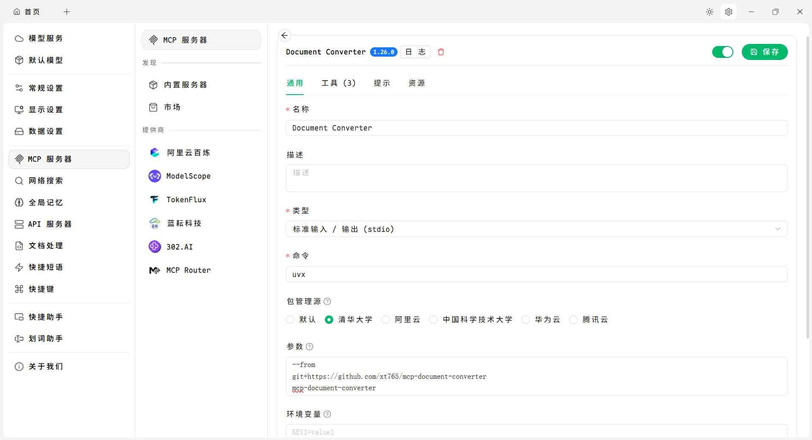
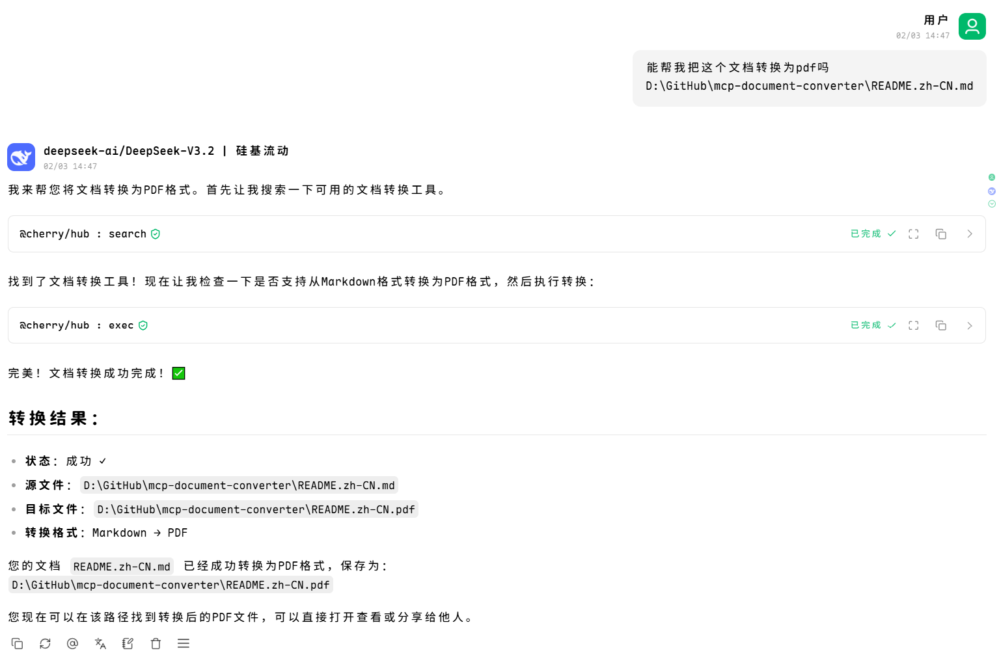

# User Guide

## Table of Contents

- [Quick Start](#quick-start)
- [MCP Configuration](#mcp-configuration)
  - [Trae IDE](#trae-ide)
  - [Claude Desktop](#claude-desktop)
  - [Cherry Studio](#cherry-studio)
- [Using as Python Library](#using-as-python-library)
- [Conversion Options](#conversion-options)
- [FAQ](#faq)

---

## Quick Start

### Installation

```bash
pip install mcp-document-converter
```

### Basic Usage

```python
from mcp_document_converter import DocumentConverter

converter = DocumentConverter()

# Convert Markdown to HTML
result = converter.convert("document.md", "html")
print(f"Output: {result.output_path}")

# Convert HTML to PDF
result = converter.convert("document.html", "pdf")

# Convert DOCX to Markdown
result = converter.convert("document.docx", "markdown")
```

---

## MCP Configuration

### Trae IDE

Add to your MCP configuration file:

```json
{
  "mcpServers": {
    "mcp-document-converter": {
      "command": "uvx",
      "args": ["mcp-document-converter"]
    }
  }
}
```

### Claude Desktop

```json
{
  "mcpServers": {
    "mcp-document-converter": {
      "command": "uvx",
      "args": ["mcp-document-converter"]
    }
  }
}
```

### Cherry Studio





---

## Using as Python Library

### Basic Conversion

```python
from mcp_document_converter import DocumentConverter

converter = DocumentConverter()
result = converter.convert("input.md", "html")

if result.success:
    print(f"Converted to: {result.output_path}")
    print(f"Content: {result.content[:100]}...")
else:
    print(f"Error: {result.error_message}")
```

### Custom Registry

```python
from mcp_document_converter import DocumentConverter
from mcp_document_converter.registry import ConverterRegistry
from mcp_document_converter.parsers import MarkdownParser, HTMLParser
from mcp_document_converter.renderers import HTMLRenderer, PDFRenderer

# Create custom registry
registry = ConverterRegistry()
registry.register_parser(MarkdownParser())
registry.register_parser(HTMLParser())
registry.register_renderer(HTMLRenderer())
registry.register_renderer(PDFRenderer())

# Use custom registry
converter = DocumentConverter(registry)
```

### Working with DocumentIR

```python
from mcp_document_converter import DocumentConverter

converter = DocumentConverter()

# Parse to intermediate representation
document = converter.convert_to_ir("input.md")

# Modify document
document.title = "New Title"
document.metadata["custom_field"] = "value"

# Render to multiple formats
converter.render_from_ir(document, "html", output_path="output.html")
converter.render_from_ir(document, "pdf", output_path="output.pdf")
```

### Batch Conversion

```python
from pathlib import Path
from mcp_document_converter import DocumentConverter

converter = DocumentConverter()

# Convert all Markdown files in a directory
for md_file in Path("docs").glob("*.md"):
    result = converter.convert(md_file, "html")
    print(f"Converted {md_file} -> {result.output_path}")
```

---

## Conversion Options

### HTML Options

```python
result = converter.convert(
    "input.md",
    "html",
    options={
        "css": "body { font-family: Arial; }",
        "template": "default",
        "preserve_metadata": True,
        "extract_images": True
    }
)
```

### PDF Options

```python
result = converter.convert(
    "input.md",
    "pdf",
    options={
        "template": "default",
        "css": "@page { size: A4; }",
        "preserve_metadata": True
    }
)
```

### Markdown Options

```python
result = converter.convert(
    "input.html",
    "markdown",
    options={
        "preserve_metadata": True,
        "code_style": "fenced"
    }
)
```

---

## FAQ

### Q: What formats are supported?

**A:** The converter supports 5 formats:
- **Input:** Markdown, HTML, DOCX, PDF, Text
- **Output:** Markdown, HTML, DOCX, PDF, Text

### Q: How do I handle conversion errors?

```python
result = converter.convert("input.md", "html")

if not result.success:
    print(f"Error: {result.error_message}")
    # Handle error
```

### Q: Can I extend with custom parsers/renderers?

**A:** Yes! Create a class that inherits from `BaseParser` or `BaseRenderer`:

```python
from mcp_document_converter.core.parser import BaseParser
from mcp_document_converter.core.ir import DocumentIR

class MyParser(BaseParser):
    @property
    def supported_extensions(self):
        return [".myext"]
    
    @property
    def format_name(self):
        return "myformat"
    
    def parse(self, source, **options):
        # Your parsing logic
        return DocumentIR(title="My Document")

# Register
from mcp_document_converter.registry import get_registry
get_registry().register_parser(MyParser())
```

### Q: Does it work on Windows?

**A:** Yes, the converter works on Windows, macOS, and Linux. For PDF rendering with WeasyPrint, you may need to install GTK dependencies on Windows.

### Q: How do I preserve images during conversion?

**A:** Images are automatically extracted and preserved. Use the `extract_images` option:

```python
result = converter.convert(
    "input.docx",
    "html",
    options={"extract_images": True}
)
```

### Q: Can I convert without saving to file?

**A:** Yes, the `ConversionResult.content` contains the output:

```python
result = converter.convert("input.md", "html")

if result.success:
    html_content = result.content
    # Use content directly without saving
```
